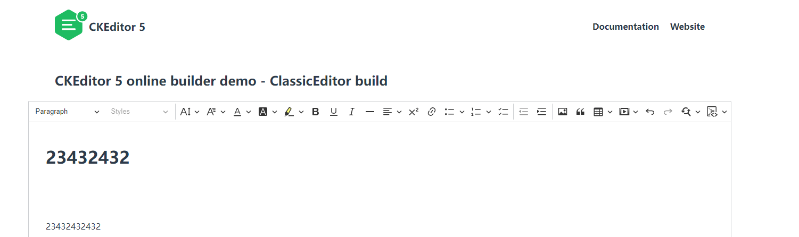
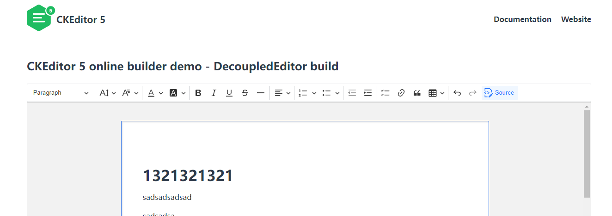

# Vue 3 + Vite

This template should help get you started developing with Vue 3 in Vite. The template uses Vue 3 `<script setup>` SFCs, check out the [script setup docs](https://v3.vuejs.org/api/sfc-script-setup.html#sfc-script-setup) to learn more.

## Recommended IDE Setup

- [VS Code](https://code.visualstudio.com/) + [Volar](https://marketplace.visualstudio.com/items?itemName=Vue.volar)

## 介绍
CKEditor5官网地址：https://ckeditor.com/ckeditor-5/online-builder/

参考笔记：CKEditor5+vue3使用以及如何添加新工具栏(https://note.youdao.com/s/VTfl2KSo)

CKEditorClassic 是CKEditor5的 经典 案例

CKEditorDocument 是CKEditor5的 Decoupled document 案例

CKEditorRich 是安装了@gwq/ckeditor5-custom-build 一个自定义工具条的一个案例

```bash
// 安装0.0.3版本
npm i @gwq/ckeditor5-custom-build
```


```bash
npm i gwq/ckeditor5-custom-document-build
```


